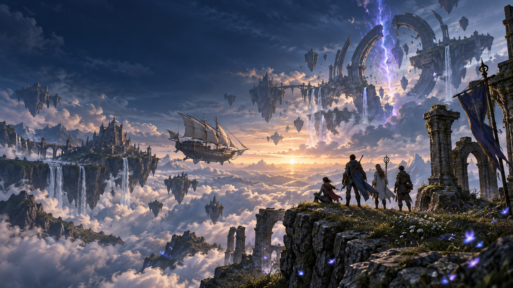

# Aetherbound

Aetherbound is a complete, browser-playable 3D turn-based RPG built with Godot 4.7.1.
It follows a fourteen-character ensemble through two continents, a broken second world,
ATB battles, summons, an airship, and an ending.

**Play:** [aetherbound.uy.sg](https://aetherbound.uy.sg)



The Godot build is published at the site root. The original JavaScript implementation remains
available at [/js/](https://aetherbound.uy.sg/js/) as the executable reference used by the
port's parity tests.

## Run the Godot build

Install Node.js 22 and Godot 4.7.1, then:

```bash
npm ci
GODOT=/path/to/godot npm run export:web
npm run smoke:web -- --timeout 420
```

The export is written to `build/web`. To work in the editor, open
`godot/project.godot` directly.

Useful checks:

```bash
GODOT=/path/to/godot npm run port       # full Godot/reference parity suite
npm run authored-assets                 # generated-model and runtime-geometry guard
npm run smoke:web -- --timeout 420      # browser playthrough and all-map traversal
npm run checks                          # reference content/reachability audits
```

## Controls

- **Move:** Arrow keys or WASD
- **Run:** Shift
- **Confirm:** Enter or Z
- **Cancel:** Escape or X
- **Menu:** C
- **Rotate camera:** Q / E
- **Pause:** P
- **Flee:** both gamepad shoulder buttons

Movement is camera-relative. Keyboard, gamepad, and touch controls are supported.

## The game

The main story starts in Harrowmere. Speak to Elder Sabbath, leave across the south bridge,
and follow the road through the Fen Barrow, Solmere, the Ferran Outpost, Ashenhall, the
Cinderspine Pass, and the Ninth Well. Five mandatory bosses lead to the world's break, the
ruined continent, Vhaine, and the ending.

The broader game contains:

| Content | Shipping build |
|---|---:|
| Playable cast | 14 recruitable characters |
| Bestiary | 200 enemies and 45 bosses |
| World | 95 authored maps, 121 whole/ruin variants |
| Story and side content | 124 verified event scenarios |
| Score | 36 tracks |
| Items / spells / espers | 275 / 58 / 26 |
| Shops | 19 |
| World states | Whole and ruin |
| Traversal | Field, interiors, world map, airship |

The direct story path is about ninety minutes. Completing the optional bosses, quests, second
continent, and full bestiary is on the order of forty hours. Both figures are estimates derived
from the real map distances, encounter rates, and content graph.

## Generated 3D art

Every shipping character, creature, and scenery model has generated provenance recorded in
`godot/data/credits.json`. The current manifest contains 86 entries:

- 14 party models
- 9 crowd models
- 36 bestiary models
- 27 scenery models

The 3D pipeline starts from a generated concept view, reconstructs it into a mesh, then cleans,
decimates, rigs, animates, and exports the result as GLB. The concept views remain in
`assets/concepts`, so every model can be traced to its source. The title vista, painted sky, and
app icon were generated for this project with OpenAI's built-in image generation tool; their
prompts and provenance are recorded beside the assets in `godot/assets/ui` and
`godot/assets/sky`.

Party and crowd models carry baked skeletal animation clips in their GLBs. Creature clips are
resolved from their own baked animation libraries. The automated probes currently verify 23
character models with 202 clips and 36 creature models answering 252 gameplay animation
requests. They sample bone movement as well as clip names, so a rigged model that does not
actually deform fails the build.

## Authored world

Maps are authored terrain grids with explicit coordinates for buildings, props, NPCs,
triggers, encounters, doors, chests, and events. Godot translates that data into imported GLB
instances and collision cells. It does not generate terrain, buildings, foliage, dungeons, or
placements at runtime.

`npm run authored-assets` enforces that boundary. It scans every shipping GDScript for mesh
and noise construction outside the FX renderer, then checks that every credited 3D model is
marked as generated and points to an existing concept image. `MultiMesh` batches imported
floor and wall meshes in fixed 12×12-tile culling cells, so large authored maps do not submit
distant geometry; it does not manufacture geometry. Short-lived spell arcs, shockwaves, light
pillars, and particle quads are visual effects and are confined to `godot/scripts/fx`.

Tree facing uses a fixed function of its authored tile coordinate. It never calls random noise,
so the same map is visually identical between runs. Randomness is reserved for game rules such
as encounter rolls, combat variance, and loot, with explicit saved RNG streams.

## Presentation

The Godot presentation combines authored map palettes with a generated panoramic cloud sky.
Each location controls its own zenith, horizon, fog, ground, cloud strength, and grade, while
the panorama supplies painted cloud detail. Enclosed maps clear the outdoor sky and sun, then
use their authored fog colour and placed lamps; save crystals cast their own cool aether light.
The title and browser loading screen use a generated cinematic vista with a restrained aether
pulse, and the field and menu interfaces share the same navy, brass, and gold window treatment.

Battle presentation includes:

- 3D party and enemy formations with baked idle, attack, cast, hurt, victory, and defeat motion
- ATB in wait or active mode
- 25 statuses, elemental affinities, rows, critical hits, reflect, and phased enemy AI
- a centered encounter banner, combat narration, damage numbers, particles, and spell effects
- rewards, bestiary recording, boss scenes, defeat rollback, and music restoration

## Music and audio

The score is composed as note data around the Aetherbound motif: a rising minor sixth followed
by a stepwise fall. The Godot build ships 36 rendered OGG tracks and 10 sound effects. Rendering
ahead of time gives the browser build predictable playback and preserves the composed
arrangements.

The audio parity test decodes every file, checks duration and loop seams, re-renders a sample
through the JavaScript score engine, compares perceptual fingerprints, and verifies that every
map and world state names a shipping cue. The browser test also confirms battle transitions,
field restoration, configuration volume changes, and title audio initialization.

## Systems

The game includes:

- ATB combat with character-specific commands, summons, magic learning, equipment, rows, and
  status effects
- menus, shops, inns, save points, chests, dialogue, scripted scenes, quests, and configuration
- save compatibility between the JavaScript reference and Godot port
- two world states with map-specific ruin changes
- world-map airship boarding, flight, and landing
- keyboard, gamepad, and touch input
- optional privacy-respecting analytics, disabled unless configured

The reference implementation remains the behavioral specification. The parity suite compares
Godot with it across formulas, data, enemy decisions, RNG streams, growth, commands, maps,
encounters, analytics, battles, events, effects, saves, audio, scenery, models, animation, and
bestiary behavior.

## Automated evidence

The deployment workflow gates the live site on two independent jobs:

1. **Port parity** imports the Godot project and runs the complete comparison suite.
2. **Browser proof** exports WebAssembly and plays the real browser build through field
   movement, the opening scene, battle, spells, menus, equipment, shops, inns, saves, legacy
   save migration, defeat rollback, scene-driven boss combat, airship travel, touch controls,
   all 95 maps, model credits, audio transitions, and analytics behavior.

The browser run fails on console errors, engine warnings, missing network resources, absent
models, broken animation, or a black canvas. GitHub Pages publishes only after both jobs
succeed.

## Project layout

```text
godot/
  assets/
    cast/       generated party and crowd GLBs
    monsters/   generated creature GLBs
    props/      generated scenery GLBs and placement plan
    sky/        generated panoramic sky and provenance
    textures/   authored material plates
    ui/         generated title art and provenance
  audio/        rendered music and sound effects
  data/         game tables exported for Godot
  scenes/       title and field scenes
  scripts/      engine, world, battle, UI, FX, and game state
  shaders/      painted sky and presentation shaders
  tools/        headless Godot probes

src/            JavaScript reference implementation
tools/          exporters, audits, parity harnesses, and browser smoke tests
.github/        gated GitHub Pages deployment
```

## Content integrity

The project audits its content graph backward as well as forward. A valid reference proves that
an item exists; the reachability audit also proves that players can obtain it. This catches
unreachable chests, unmentioned quests, unteachable spells, unused relic effects, and bosses
with no route.

The main-line checks cover:

1. Harrowmere to the Fen Barrow and the Bogfather
2. Solmere, Aurelian and Bastian recruitment, the Ferran Outpost, and the Ferran Warden
3. Ashenhall, the Eighth Lantern, and Idris's gate
4. Cinderspine Pass and the Cinder Wyrm
5. The Ninth Well, the world break, Vhaine, and the ending

Optional routes include the Standing Oak, Toll Baron, Weeping Wood, Drowned Coast, additional
recruitments, two continents, and 45 total bosses.

## Deployment

Pushes to `main` run `.github/workflows/pages.yml`. The workflow exports the Godot build,
runs the browser and parity gates, publishes Godot at `/`, and keeps the JavaScript reference
at `/js/`. A failed Godot gate cannot silently replace the root with an unverified build.
